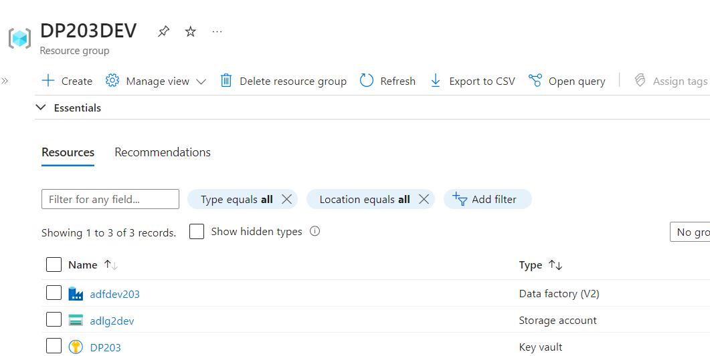
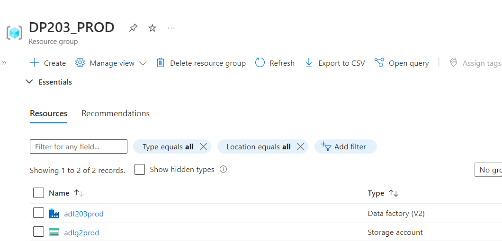
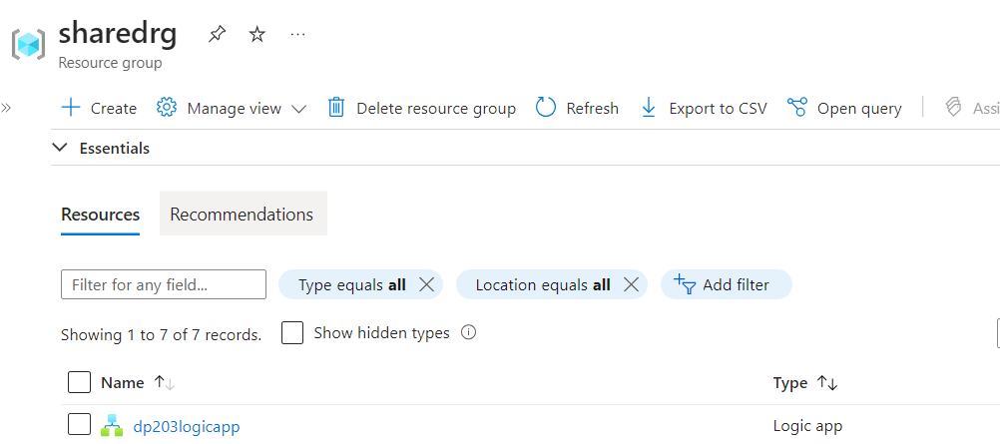
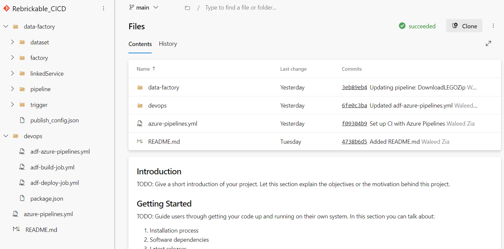
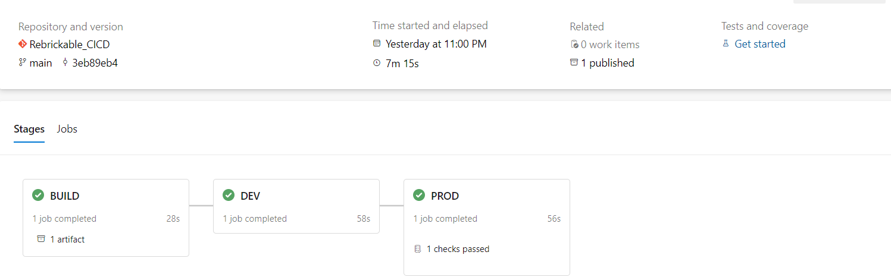
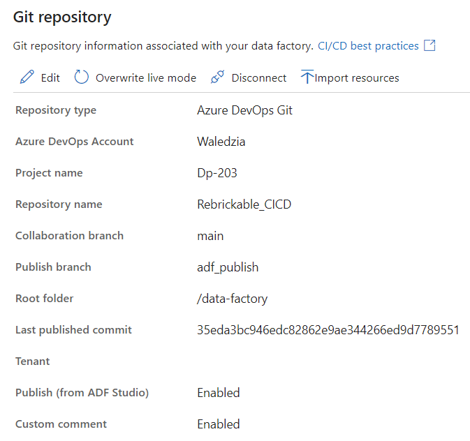
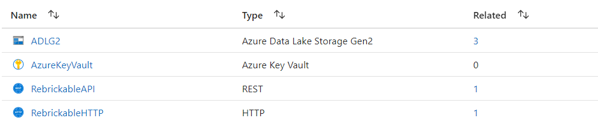
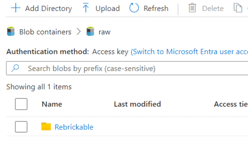

# LEGO Data Ingestion Pipeline Using Azure Data Factory

## Table of Contents

1. [Overview](#section-1-overview)
   - 1.1 [Overview of Resource Groups](#1-overview-of-resource-groups)
   - 1.2 [Development Environment Resources](#2-development-environment-resources)
   - 1.3 [Production Environment Resources](#3-production-environment-resources)
   - 1.4 [Shared Resource Group](#4-shared-resource-group)
   - 1.5 [Git Repository Overview](#5-git-repository-overview)
   - 1.6 [Azure DevOps CI/CD Pipeline](#6-azure-devops-cicd-pipeline)
   - 1.7 [Git Configuration in Development Data Factory](#7-git-configuration-in-development-data-factory)
   - 1.8 [Linked Services](#8-linked-services)
   - 1.9 [Final Pipeline Workflow](#9-final-pipeline-workflow)
2. [Pipeline Breakdown](#section-2-pipeline-breakdown)
   - 2.1 [Get API Key, Username, and Password from Key Vault](#1-get-api-key-username-and-password-from-key-vault)
   - 2.2 [Generate User Token](#2-generate-user-token)
   - 2.3 [Looping Through Users and Fetching Data](#3-looping-through-users-and-fetching-data)
   - 2.4 [Downloading Zip Files](#4-downloading-zip-files)
   - 2.5 [Error Handling](#5-error-handling)
   - 2.6 [Final Wait Activity](#6-final-wait-activity)
   - 2.7 [Variables](#variables)

---

## Section 1: Overview

This Azure Data Factory (ADF) pipeline automates the ingestion of LEGO data files and user-specific data from the Rebrickable API into **Azure Data Lake Storage (ADLS)**. It securely retrieves credentials from **Azure Key Vault**, handles large data volumes using **pagination** and **throttling**, and includes error-handling mechanisms. Additionally, a **Logic App** is employed to send custom notifications to the admin in case of failures or critical events.

### 1. Overview of Resource Groups

The image illustrates three Azure Resource Groups associated with an Azure subscription:

- **DP203_PROD** (Production)
- **DP203_DEV** (Development)
- **SHAREDRG** (Shared)

Each resource group holds specific resources required for different stages of the workflow:

- **DP203_PROD**: Contains resources for the production environment.
- **DP203_DEV**: Contains resources for the development environment.
- **SHAREDRG**: Contains shared resources, such as Logic Apps for error management across both environments.
   
   

 
 
### 2. Development Environment Resources

In the development environment, three core resources handle data integration, storage, and security:

- **adfdev203** (Data Factory V2)
- **adlg2dev** (Storage Account)
- **DP203** (Key Vault)
   
   

 
 

### 3. Production Environment Resources

In the production environment, two core resources are used:

- **adf203prod** (Data Factory V2)
- **adlg2prod** (Storage Account)
- **DP203** (Key Vault from DEV) to fetch secrets.

 
 

 
 

### 4. Shared Resource Group

The **dp203logicapp** (Logic App) is shared between development and production environments, handling failure notifications via email.

 
 

 
 

### 5. Git Repository Overview

The Git repository **Rebrickable_CICD** contains Data Factory configurations and DevOps setup. It includes:

- **data-factory**: Contains datasets, linked services, pipelines, and triggers.
- **devops**: Contains YAML files for CI/CD pipelines.

 
 

 
 

### 6. Azure DevOps CI/CD Pipeline

The CI/CD pipeline for the **Rebrickable_CICD** repository contains three stages:

- **BUILD**: Status - SUCCESS
- **DEV**: Status - SUCCESS
- **PROD**: Status - SUCCESS

 
 

 
 

### 7. Git Configuration in Development Data Factory

The image shows Git configuration in the **adfdev203** Data Factory, crucial for version control and CI/CD workflows.

 
 

 
 

### 8. Linked Services

The pipeline connects with Azure services and external APIs through linked services:

- **ADLG2**: Azure Data Lake Storage Gen2
- **AzureKeyVault**: Azure Key Vault
- **RebrickableAPI**: REST
- **RebrickableHTTP**: HTTP

 
 

 
 

### 9. Final Pipeline Workflow

The image depicts the final workflow of the pipeline, detailing tasks required for data integration.

 
 

 
 

---

## Section 2: Pipeline Breakdown

## Pipeline Documentation: `DownloadLEGOZip`

This Azure Data Factory pipeline orchestrates the process of downloading files from a web source, securely retrieving API credentials from Azure Key Vault, generating an API authentication token, and handling errors effectively. It automates the copying of files to Azure Data Lake Storage (ADLS) and executes token-based API calls.

---

### **1. Get API Key, Username, and Password from Key Vault**

#### **Activities:**

- **Get Key From Key Vault**
- **Get Username From Key Vault**
- **Get Password From Key Vault**

#### **Description:**

The pipeline securely retrieves the necessary credentials for API authentication (API Key, Username, and Password) from **Azure Key Vault** using **Managed Service Identity (MSI)**. Each credential is fetched via a **Web Activity** which accesses the Key Vault using a secure, preconfigured identity, ensuring that no hard-coded credentials are exposed within the pipeline.

- **Key Vault URL**: Each secret (API Key, Username, and Password) is fetched from a unique Key Vault endpoint.
- **Retries**: There are **no retry policies** defined for these activities.
- **Secure Handling**: The output and input of these activities are **not secured**, meaning they can be inspected for troubleshooting.

---

### **2. Generate User Token**

#### **Activity:**

- **Generate User Token**

#### **Description:**

This step generates a user token required for authenticated API requests to the **Rebrickable API**. The token is created by sending a `POST` request to the Rebrickable API's authentication endpoint. This request includes the credentials (username and password) retrieved from Azure Key Vault.

- **Request Method**: `POST`
- **Headers**:
  - **Authorization**: The API key retrieved from Key Vault is passed in the header using `Bearer {API_KEY}`.
  - **Content-Type**: `application/x-www-form-urlencoded`
  - **Accept**: `application/json`
- **Body**: The username and password are concatenated and passed as form data in the body (e.g., `username=exampleUsername&password=examplePassword`).
- **Purpose**: The generated token is stored in a variable for use in subsequent API requests.
- **Retries**: There are **no retry policies** defined for this activity.
- **Token Storage**: The token is stored in the pipeline's `token` variable for later use.

---

### **3. Looping Through Users and Fetching Data**

#### **Activity:**

- **Loop Over Users**

#### **Description:**

The pipeline loops over a predefined list of users (`allparts`, `partlists`) and fetches data for each user by making authenticated API calls to the **Rebrickable API**. The loop uses the token generated in the previous step for authorization and downloads the user's data in JSON format.

- **Items**: The list of users is stored in a variable called `userlist`.
- **Execution Mode**: The loop iterates through the users sequentially.
- **API Authorization**: Each API request includes the `Bearer {token}` in the Authorization header.
- **Pagination Handling**: The pipeline automatically handles API pagination using the `AbsoluteUrl` rule (e.g., following the `next` pointer in the response) to fetch all available data.
- **Throttling**: Requests are throttled by using a request interval of **1 second** between API calls to avoid triggering API rate limits.
- **Data Format**: The response data is written in **JSON format**.
- **Storage**: The fetched data is stored in **Azure Data Lake Storage Gen 2 (ADLS G2)** using the `JsonSink` setting.
- **Timeout**: Each request has a timeout of **1 minute 40 seconds**.

---

### **4. Downloading Zip Files**

#### **Activity:**

- **Download all the zip files** (within a `ForEach` loop)
- **Sub-Activity:** `CopyfromWebtoADLG2`

#### **Description:**

This step downloads a list of zip files from the Rebrickable API and stores them in **Azure Data Lake Storage Gen 2 (ADLS G2)**. The pipeline iterates over a predefined list of files (`themes.csv.gz`, `colors.csv.gz`), downloading each file sequentially.

- **Items**: A predefined list of file URLs is passed into the `CopyfromWebtoADLG2` activity.
- **File Format**: Files are in **Gzip** compressed format and stored in a **zip** format.
- **Destination**: Files are written to an ADLS Gen 2 directory (configured in the linked service).

---

### **5. Error Handling**

#### **Activity:**

- **Error Handling** (Web Activity)

#### **Description:**

An error handling mechanism is incorporated in the pipeline using an **Azure Logic App**. If the pipeline encounters any failures during execution, an alert email is sent to the **admin** and other relevant parties. The Logic App triggers when the pipeline status transitions to **Failed** or **Warning**.

- **Notification**: A failure email notification includes a detailed message about the failure and recommended actions.

---

### **6. Final Wait Activity**

#### **Description:**

The pipeline includes a wait activity that will execute the error handling activity if anything goes wrong during the process. Otherwise, it will finish the pipeline successfully. This mechanism ensures proper error management and guarantees a smooth completion of the pipeline when no issues are encountered.

---

### **7. Variables**

#### **Key Variables:**

- `token`: Stores the generated API authentication token for API requests.
- `userlist`: Stores the list of users to be processed in the loop.
- `allparts`, `partlists`: Holds user-specific data for API calls.

 

Once all the changes are published to the development environment, they are automatically deployed to the production environment through the CI/CD pipeline configured in **Azure DevOps**. This pipeline streamlines the deployment process, ensuring that changes are validated, tested, and moved seamlessly from dev to prod. The pipeline handles the transition of resources such as pipelines, datasets, and linked services within **Azure Data Factory**, making sure that everything is up-to-date and correctly configured.

The following image illustrates the folder hierarchy that is dynamically generated during the deployment. These folders are created as part of the pipeline's activities, along with the associated data files, showcasing the automation and organization provided by **Azure Data Factory** in managing and structuring the production data environment efficiently. This process ensures that the production environment mirrors the development setup while maintaining consistency and minimizing manual intervention.

 
 

## Contributing

Contributions are welcomed! Feel free to submit pull requests or raise issues for any bugs or suggestions for improvements.

## License

This project is licensed under the **MIT License**. For more information, refer to the LICENSE file.
